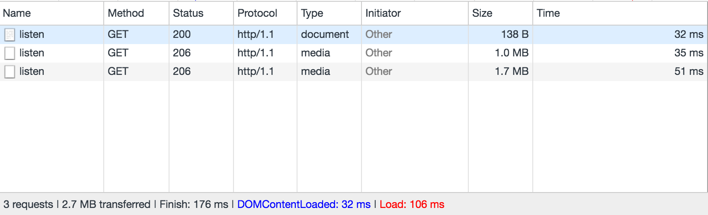

# Jersey 2 Media Streaming Application

Example showing how to implement a media streaming resource in Jersey 2 JAX-RS application using Jetty connector.

Partial content using range headers is the recommended approach to stream media. Here is a simple implementation
that streams an audio file. The core of the logic lies in detecting whether clients support range requests.
Some browsers send range headers when they detect specific media type such as "audio/mp3", "video/mp4" etc.
response from the server. Chrome, Safari, Opera, Edge make use of these range headers when streaming media.

```java
        // Firefox does not send range headers
        if (range == null) {
            StreamingOutput streamer = output -> {
                try (FileChannel inputChannel = new FileInputStream(asset).getChannel(); WritableByteChannel outputChannel = Channels.newChannel(output)) {
                    inputChannel.transferTo(0, inputChannel.size(), outputChannel);
                }
            };
            return Response.ok(streamer).status(200).header(HttpHeaders.CONTENT_LENGTH, asset.length()).build();
        }

        String[] ranges = range.split("=")[1].split("-");
        final int from = Integer.parseInt(ranges[0]);

        /*
          Chunk media if the range upper bound is unspecified. Chrome, Opera sends "bytes=0-"
         */
        int to = chunk_size + from;
        if (to >= asset.length()) {
            to = (int) (asset.length() - 1);
        }
        if (ranges.length == 2) {
            to = Integer.parseInt(ranges[1]);
        }

        final String responseRange = String.format("bytes %d-%d/%d", from, to, asset.length());
        final RandomAccessFile raf = new RandomAccessFile(asset, "r");
        raf.seek(from);

        final int len = to - from + 1;
        final MediaStreamer streamer = new MediaStreamer(len, raf);
        Response.ResponseBuilder res = Response.ok(streamer)
                .status(Response.Status.PARTIAL_CONTENT)
                .header("Accept-Ranges", "bytes")
                .header("Content-Range", responseRange)
                .header(HttpHeaders.CONTENT_LENGTH, streamer.getLenth())
                .header(HttpHeaders.LAST_MODIFIED, new Date(asset.lastModified()));
```


Setup
------

* Clone this repository
* mvn install

Testing
-------

Run App in your favorite IDE.

Access the streaming resource
---------------------

The media will be streamed at the following URL: <http://localhost:9998/listen>.

Request and responses logged for various browsers.

Chrome
------



```
    Aug 06, 2017 1:04:49 PM org.glassfish.jersey.logging.LoggingInterceptor log
    INFO: 2 * Server has received a request on thread qtp1374066265-18
    2 > GET http://localhost:9998/listen
    2 > Accept: text/html,application/xhtml+xml,application/xml;q=0.9,image/webp,image/apng,*/*;q=0.8
    2 > Accept-Encoding: gzip, deflate, br
    2 > Accept-Language: en-US,en;q=0.8
    2 > Connection: keep-alive
    2 > Host: localhost:9998
    2 > Upgrade-Insecure-Requests: 1
    2 > User-Agent: Mozilla/5.0 (Macintosh; Intel Mac OS X 10_12_6) AppleWebKit/537.36 (KHTML, like Gecko) Chrome/59.0.3071.115 Safari/537.36
    
    Aug 06, 2017 1:04:49 PM org.glassfish.jersey.logging.LoggingInterceptor log
    INFO: 2 * Server responded with a response on thread qtp1374066265-18
    2 < 200
    2 < Content-Length: 2836624
    2 < Content-Type: audio/mp3
    
    Aug 06, 2017 1:04:49 PM org.glassfish.jersey.logging.LoggingInterceptor log
    INFO: 3 * Server has received a request on thread qtp1374066265-18
    3 > GET http://localhost:9998/listen
    3 > Accept: */*
    3 > Accept-Encoding: identity;q=1, *;q=0
    3 > Accept-Language: en-US,en;q=0.8
    3 > Connection: keep-alive
    3 > Host: localhost:9998
    3 > Range: bytes=0-
    3 > Referer: http://localhost:9998/listen
    3 > User-Agent: Mozilla/5.0 (Macintosh; Intel Mac OS X 10_12_6) AppleWebKit/537.36 (KHTML, like Gecko) Chrome/59.0.3071.115 Safari/537.36
    
    Aug 06, 2017 1:04:49 PM org.glassfish.jersey.logging.LoggingInterceptor log
    INFO: 3 * Server responded with a response on thread qtp1374066265-18
    3 < 206
    3 < Accept-Ranges: bytes
    3 < Content-Length: 1048577
    3 < Content-Range: bytes 0-1048576/2836624
    3 < Content-Type: audio/mp3
    3 < Last-Modified: Sun, 06 Aug 2017 17:27:00 GMT
    
    Aug 06, 2017 1:04:50 PM org.glassfish.jersey.logging.LoggingInterceptor log
    INFO: 4 * Server has received a request on thread qtp1374066265-13
    4 > GET http://localhost:9998/listen
    4 > Accept: */*
    4 > Accept-Encoding: identity;q=1, *;q=0
    4 > Accept-Language: en-US,en;q=0.8
    4 > Connection: keep-alive
    4 > Host: localhost:9998
    4 > If-Range: Sun, 06 Aug 2017 17:27:00 GMT
    4 > Range: bytes=1048577-2836623
    4 > Referer: http://localhost:9998/listen
    4 > User-Agent: Mozilla/5.0 (Macintosh; Intel Mac OS X 10_12_6) AppleWebKit/537.36 (KHTML, like Gecko) Chrome/59.0.3071.115 Safari/537.36
    
    Aug 06, 2017 1:04:50 PM org.glassfish.jersey.logging.LoggingInterceptor log
    INFO: 4 * Server responded with a response on thread qtp1374066265-13
    4 < 206
    4 < Accept-Ranges: bytes
    4 < Content-Length: 1788047
    4 < Content-Range: bytes 1048577-2836623/2836624
    4 < Content-Type: audio/mp3
    4 < Last-Modified: Sun, 06 Aug 2017 17:27:00 GMT
```


Safari
------
```
    Aug 06, 2017 1:11:27 PM org.glassfish.jersey.logging.LoggingInterceptor log
    INFO: 1 * Server has received a request on thread qtp1374066265-17
    1 > GET http://localhost:9998/listen
    1 > Accept: text/html,application/xhtml+xml,application/xml;q=0.9,*/*;q=0.8
    1 > Accept-Encoding: gzip, deflate
    1 > Accept-Language: en-us
    1 > Connection: keep-alive
    1 > DNT: 1
    1 > Host: localhost:9998
    1 > Upgrade-Insecure-Requests: 1
    1 > User-Agent: Mozilla/5.0 (Macintosh; Intel Mac OS X 10_12_6) AppleWebKit/603.3.8 (KHTML, like Gecko) Version/10.1.2 Safari/603.3.8
    
    Aug 06, 2017 1:11:27 PM org.glassfish.jersey.logging.LoggingInterceptor log
    INFO: 1 * Server responded with a response on thread qtp1374066265-17
    1 < 200
    1 < Content-Length: 2836624
    1 < Content-Type: audio/mp3
    
    Aug 06, 2017 1:11:27 PM org.glassfish.jersey.logging.LoggingInterceptor log
    INFO: 2 * Server has received a request on thread qtp1374066265-11
    2 > GET http://localhost:9998/listen
    2 > Accept: */*
    2 > Accept-Encoding: identity
    2 > Accept-Language: en-us
    2 > Connection: keep-alive
    2 > DNT: 1
    2 > Host: localhost:9998
    2 > Range: bytes=0-1
    2 > Referer: http://localhost:9998/listen
    2 > User-Agent: Mozilla/5.0 (Macintosh; Intel Mac OS X 10_12_6) AppleWebKit/603.3.8 (KHTML, like Gecko) Version/10.1.2 Safari/603.3.8
    2 > X-Playback-Session-Id: 3330315E-8479-42C2-BFEF-36B0EA4BA735
    
    Aug 06, 2017 1:11:27 PM org.glassfish.jersey.logging.LoggingInterceptor log
    INFO: 2 * Server responded with a response on thread qtp1374066265-11
    2 < 206
    2 < Accept-Ranges: bytes
    2 < Content-Length: 2
    2 < Content-Range: bytes 0-1/2836624
    2 < Content-Type: audio/mp3
    2 < Last-Modified: Sun, 06 Aug 2017 17:27:00 GMT
    
    Aug 06, 2017 1:11:27 PM org.glassfish.jersey.logging.LoggingInterceptor log
    INFO: 3 * Server has received a request on thread qtp1374066265-17
    3 > GET http://localhost:9998/listen
    3 > Accept: */*
    3 > Accept-Encoding: identity
    3 > Accept-Language: en-us
    3 > Connection: keep-alive
    3 > DNT: 1
    3 > Host: localhost:9998
    3 > Range: bytes=0-2836623
    3 > Referer: http://localhost:9998/listen
    3 > User-Agent: Mozilla/5.0 (Macintosh; Intel Mac OS X 10_12_6) AppleWebKit/603.3.8 (KHTML, like Gecko) Version/10.1.2 Safari/603.3.8
    3 > X-Playback-Session-Id: 3330315E-8479-42C2-BFEF-36B0EA4BA735
    
    Aug 06, 2017 1:11:27 PM org.glassfish.jersey.logging.LoggingInterceptor log
    INFO: 3 * Server responded with a response on thread qtp1374066265-17
    3 < 206
    3 < Accept-Ranges: bytes
    3 < Content-Length: 2836624
    3 < Content-Range: bytes 0-2836623/2836624
    3 < Content-Type: audio/mp3
    3 < Last-Modified: Sun, 06 Aug 2017 17:27:00 GMT
    
    Aug 06, 2017 1:11:27 PM org.glassfish.jersey.logging.LoggingInterceptor log
    INFO: 4 * Server has received a request on thread qtp1374066265-13
    4 > GET http://localhost:9998/listen
    4 > Accept: */*
    4 > Accept-Encoding: identity
    4 > Accept-Language: en-us
    4 > Connection: keep-alive
    4 > DNT: 1
    4 > Host: localhost:9998
    4 > Range: bytes=131072-2836623
    4 > Referer: http://localhost:9998/listen
    4 > User-Agent: Mozilla/5.0 (Macintosh; Intel Mac OS X 10_12_6) AppleWebKit/603.3.8 (KHTML, like Gecko) Version/10.1.2 Safari/603.3.8
    4 > X-Playback-Session-Id: 3330315E-8479-42C2-BFEF-36B0EA4BA735
    
    Aug 06, 2017 1:11:27 PM org.glassfish.jersey.logging.LoggingInterceptor log
    INFO: 4 * Server responded with a response on thread qtp1374066265-13
    4 < 206
    4 < Accept-Ranges: bytes
    4 < Content-Length: 2705552
    4 < Content-Range: bytes 131072-2836623/2836624
    4 < Content-Type: audio/mp3
    4 < Last-Modified: Sun, 06 Aug 2017 17:27:00 GMT
```

Firefox
------
```
    Aug 06, 2017 1:13:22 PM org.glassfish.jersey.logging.LoggingInterceptor log
    INFO: 1 * Server has received a request on thread qtp1374066265-17
    1 > GET http://localhost:9998/listen
    1 > Accept: text/html,application/xhtml+xml,application/xml;q=0.9,*/*;q=0.8
    1 > Accept-Encoding: gzip, deflate
    1 > Accept-Language: en-US,en;q=0.5
    1 > Connection: keep-alive
    1 > DNT: 1
    1 > Host: localhost:9998
    1 > Upgrade-Insecure-Requests: 1
    1 > User-Agent: Mozilla/5.0 (Macintosh; Intel Mac OS X 10.12; rv:54.0) Gecko/20100101 Firefox/54.0
    
    Aug 06, 2017 1:13:22 PM org.glassfish.jersey.logging.LoggingInterceptor log
    INFO: 1 * Server responded with a response on thread qtp1374066265-17
    1 < 200
    1 < Content-Length: 2836624
    1 < Content-Type: audio/mp3
```

Edge
----
```
    Aug 06, 2017 2:56:03 PM org.glassfish.jersey.logging.LoggingInterceptor log
    INFO: 1 * Server has received a request on thread qtp1374066265-17
    1 > GET http://localhost:9998/listen
    1 > Accept: text/html, application/xhtml+xml, image/jxr, */*
    1 > Accept-Encoding: gzip, deflate
    1 > Accept-Language: en-US
    1 > Connection: keep-alive
    1 > DNT: 1
    1 > Host: localhost:9998
    1 > User-Agent: Mozilla/5.0 (Windows NT 10.0; Win64; x64) AppleWebKit/537.36 (KHTML, like Gecko) Chrome/52.0.2743.116 Safari/537.36 Edge/15.15063
    
    Aug 06, 2017 2:56:03 PM org.glassfish.jersey.logging.LoggingInterceptor log
    INFO: 1 * Server responded with a response on thread qtp1374066265-17
    1 < 200
    1 < Content-Length: 2836624
    1 < Content-Type: audio/mp3
    
    Aug 06, 2017 2:56:04 PM org.glassfish.jersey.logging.LoggingInterceptor log
    INFO: 2 * Server has received a request on thread qtp1374066265-16
    2 > GET http://localhost:9998/listen
    2 > Accept: */*
    2 > Accept-Encoding: gzip, deflate
    2 > Accept-Language: en-US
    2 > Cache-Control: no-cache
    2 > Connection: keep-alive
    2 > DNT: 1
    2 > GetContentFeatures.DLNA.ORG: 1
    2 > Host: localhost:9998
    2 > If-Unmodified-Since: Sun, 06 Aug 2017 17:27:00 GMT
    2 > Range: bytes=1048577-2836623
    2 > User-Agent: Mozilla/5.0 (Windows NT 10.0; Win64; x64) AppleWebKit/537.36 (KHTML, like Gecko) Chrome/52.0.2743.116 Safari/537.36 Edge/15.15063
    
    Aug 06, 2017 2:56:04 PM org.glassfish.jersey.logging.LoggingInterceptor log
    INFO: 2 * Server responded with a response on thread qtp1374066265-16
    2 < 206
    2 < Accept-Ranges: bytes
    2 < Content-Length: 1788047
    2 < Content-Range: bytes 1048577-2836623/2836624
    2 < Content-Type: audio/mp3
    2 < Last-Modified: Sun, 06 Aug 2017 17:27:00 GMT

```

Opera
------
```
    Aug 06, 2017 1:25:50 PM org.glassfish.jersey.logging.LoggingInterceptor log
    INFO: 1 * Server has received a request on thread qtp1374066265-18
    1 > GET http://localhost:9998/listen
    1 > Accept: text/html,application/xhtml+xml,application/xml;q=0.9,image/webp,image/apng,*/*;q=0.8
    1 > Accept-Encoding: gzip, deflate, br
    1 > Accept-Language: en-US,en;q=0.8
    1 > Connection: keep-alive
    1 > Host: localhost:9998
    1 > Upgrade-Insecure-Requests: 1
    1 > User-Agent: Mozilla/5.0 (Macintosh; Intel Mac OS X 10_12_6) AppleWebKit/537.36 (KHTML, like Gecko) Chrome/59.0.3071.115 Safari/537.36 OPR/46.0.2597.57
    
    Aug 06, 2017 1:25:50 PM org.glassfish.jersey.logging.LoggingInterceptor log
    INFO: 1 * Server responded with a response on thread qtp1374066265-18
    1 < 200
    1 < Content-Length: 2836624
    1 < Content-Type: audio/mp3
    
    Aug 06, 2017 1:25:50 PM org.glassfish.jersey.logging.LoggingInterceptor log
    INFO: 2 * Server has received a request on thread qtp1374066265-11
    2 > GET http://localhost:9998/listen
    2 > Accept: */*
    2 > Accept-Encoding: identity;q=1, *;q=0
    2 > Accept-Language: en-US,en;q=0.8
    2 > Connection: keep-alive
    2 > Host: localhost:9998
    2 > Range: bytes=0-
    2 > Referer: http://localhost:9998/listen
    2 > User-Agent: Mozilla/5.0 (Macintosh; Intel Mac OS X 10_12_6) AppleWebKit/537.36 (KHTML, like Gecko) Chrome/59.0.3071.115 Safari/537.36 OPR/46.0.2597.57
    
    Aug 06, 2017 1:25:50 PM org.glassfish.jersey.logging.LoggingInterceptor log
    INFO: 2 * Server responded with a response on thread qtp1374066265-11
    2 < 206
    2 < Accept-Ranges: bytes
    2 < Content-Length: 1048577
    2 < Content-Range: bytes 0-1048576/2836624
    2 < Content-Type: audio/mp3
    2 < Last-Modified: Sun, 06 Aug 2017 17:27:00 GMT
    
    Aug 06, 2017 1:25:50 PM org.glassfish.jersey.logging.LoggingInterceptor log
    INFO: 3 * Server has received a request on thread qtp1374066265-16
    3 > GET http://localhost:9998/listen
    3 > Accept: */*
    3 > Accept-Encoding: identity;q=1, *;q=0
    3 > Accept-Language: en-US,en;q=0.8
    3 > Connection: keep-alive
    3 > Host: localhost:9998
    3 > If-Range: Sun, 06 Aug 2017 17:27:00 GMT
    3 > Range: bytes=1048577-2836623
    3 > Referer: http://localhost:9998/listen
    3 > User-Agent: Mozilla/5.0 (Macintosh; Intel Mac OS X 10_12_6) AppleWebKit/537.36 (KHTML, like Gecko) Chrome/59.0.3071.115 Safari/537.36 OPR/46.0.2597.57
    
    Aug 06, 2017 1:25:50 PM org.glassfish.jersey.logging.LoggingInterceptor log
    INFO: 3 * Server responded with a response on thread qtp1374066265-16
    3 < 206
    3 < Accept-Ranges: bytes
    3 < Content-Length: 1788047
    3 < Content-Range: bytes 1048577-2836623/2836624
    3 < Content-Type: audio/mp3
    3 < Last-Modified: Sun, 06 Aug 2017 17:27:00 GMT
```


Mp3 Credit
----------
http://publicdomain4u.com/scott-joplin-the-entertainer/mp3-download